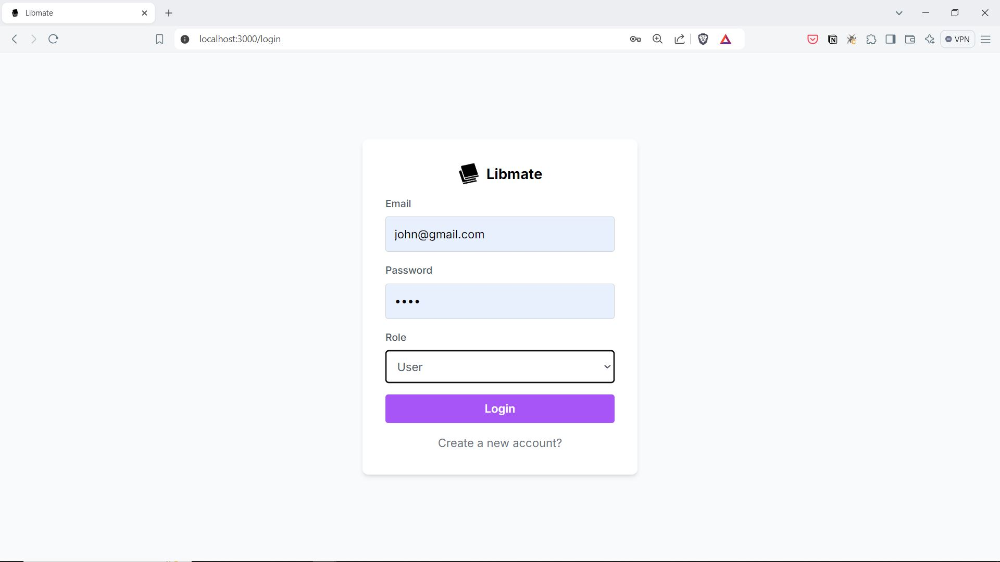
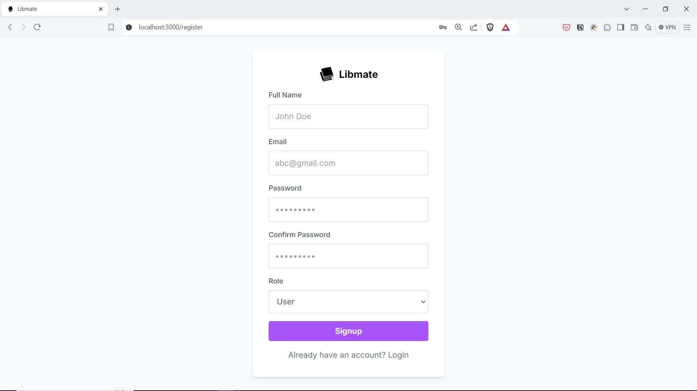
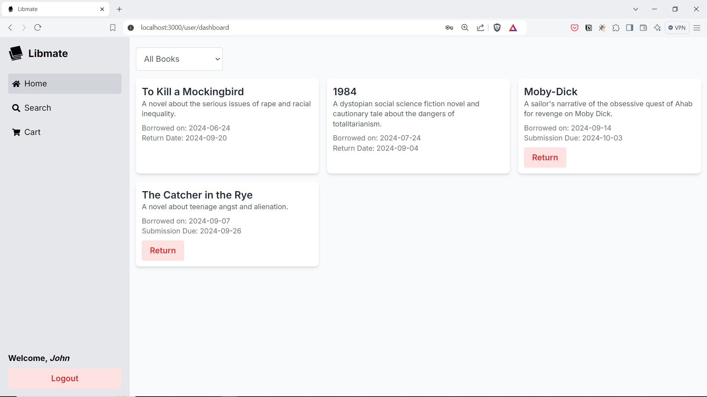
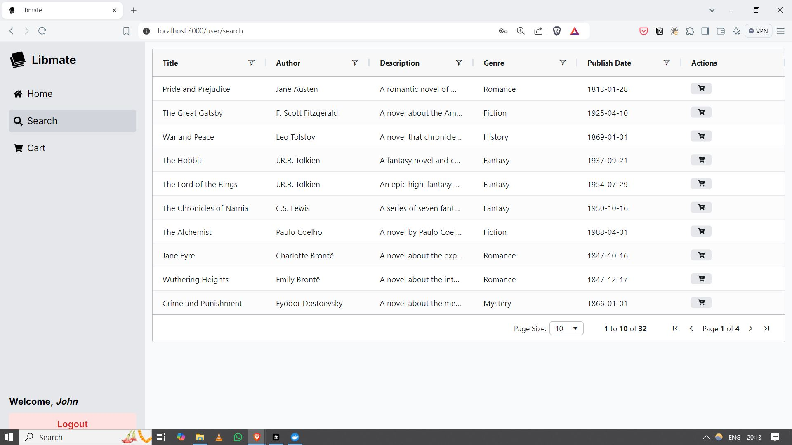
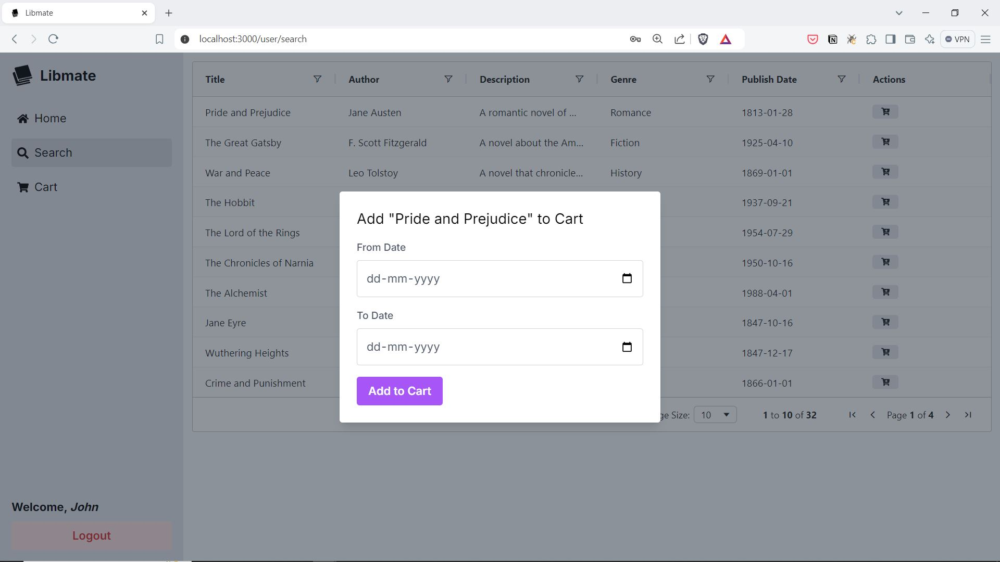
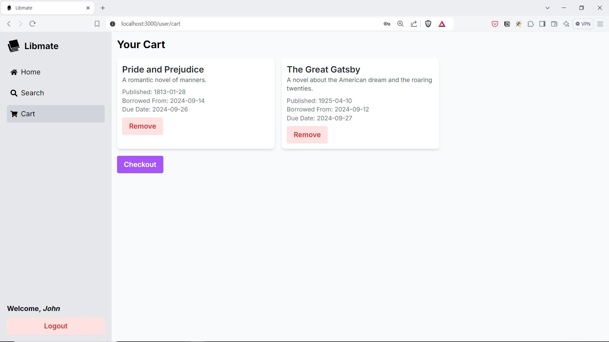
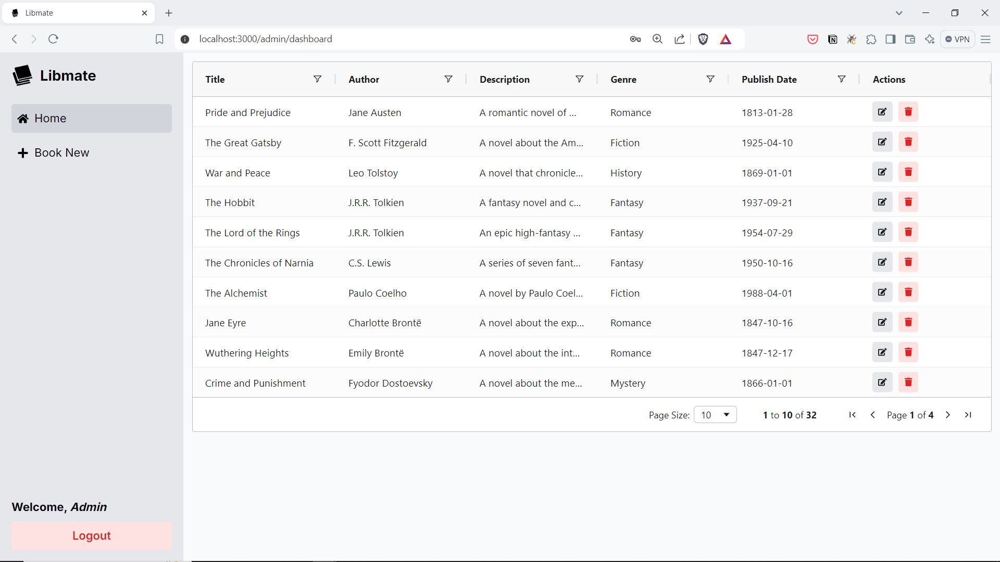
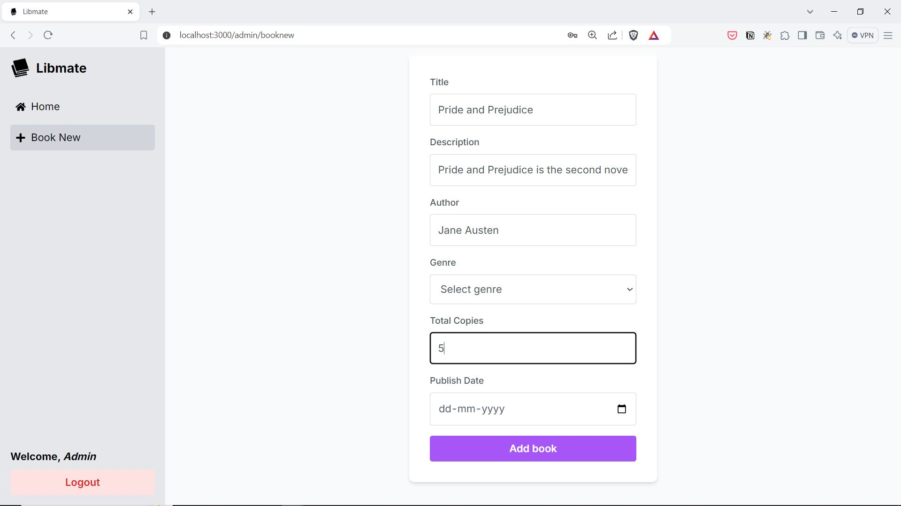
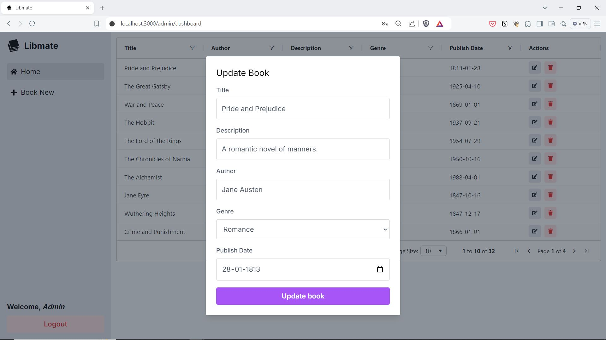

# Library Management System

A full stack application for a library book vending application. It is designed to manage book inventories, and member management, ensuring a seamless experience for borrowing and returning books through automated vending machines.

## Media - User Portal

<video width="320" height="240" controls>
  <source src="./media/libmate_user_demo.mp4" type="video/mp4">
</video>

https://github.com/user-attachments/assets/beebd49a-4143-4efb-a8ec-5e95c4675e0a

#### User - Login Page

#### User - Register Page

#### User - Dashboard Page

#### User - Search Page

#### User - Add Book to Cart Page

#### User - Cart Page

## Media - Admin Portal

<video width="320" height="240" controls>
  <source src="./media/libmate_admin_demo.mp4" type="video/mp4">
</video>

https://github.com/user-attachments/assets/245bd896-74c6-43ae-9126-12d275c7b481

#### Admin - Login Page

#### Admin - Dashboard Page

#### Admin - Add Book Page

#### Admin - Update Book Page

## Techstack used
- NextJS
- Redux Toolkit
- Redux Persist
- Tailwindcss
- FastAPI
- Postgres
- Alembic
- SQLAlchemy
- Docker

## Features

- User Authentication
  - Admin and User login functionality
  - Secure credential management

- Book Management
  - Add, edit, and remove books from the library catalog
  - Track book availability and loan status

- User Management
  - Register new library Admins and Users

- Loan Management
  - Check out and return books

## Installation

Prerequisites: Docker

1. Clone the repository
2. Run `docker compose -f docker-compose-production.yml up` to start the all instances
3. Run `docker compose -f docker-compose-production.yml down` to stop the all instances
4. Run `docker compose -f docker-compose-production.yml up --build` to build and start the all instances
5. Frontend will be running on `http://localhost:3000`
6. Backend will be running on `http://localhost:8081`
7. Database will be running on `http://localhost:5432`

## Usage

### Admin Access
- Email: admin@gmail.com
- Password: admin

### User Access
- Email: john@gmail.com
- Password: demo

# License

Copyright (c) 2024 [Y. Siva Sai Krishna](https://github.com/ysskrishna)

This project is licensed under the AGPL-3.0 License - see the LICENSE file for details.
